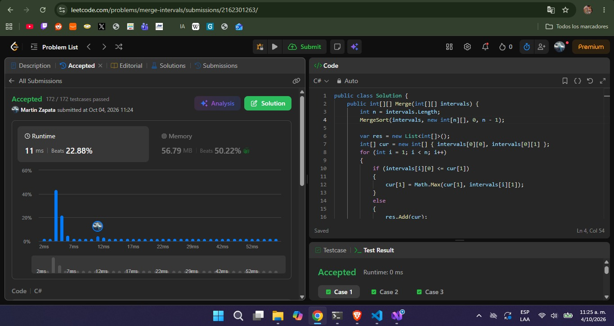
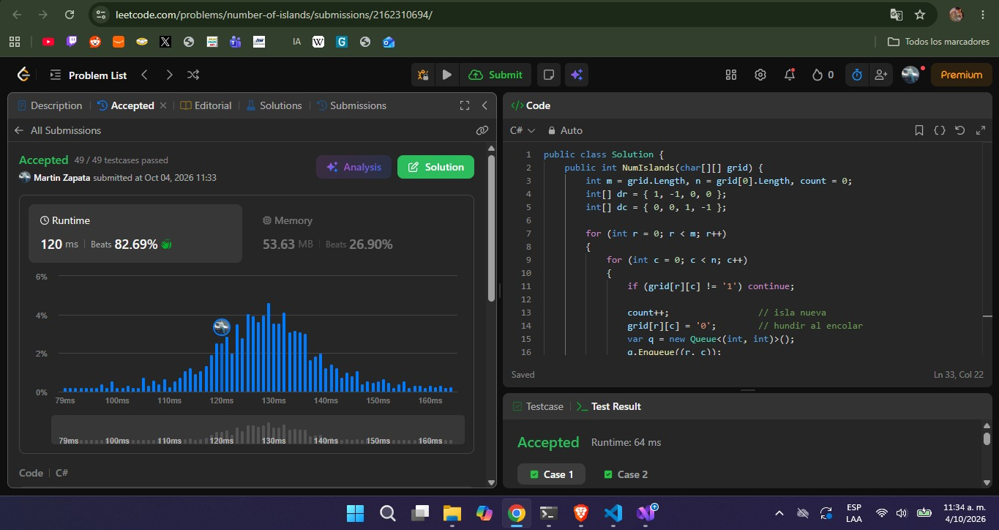
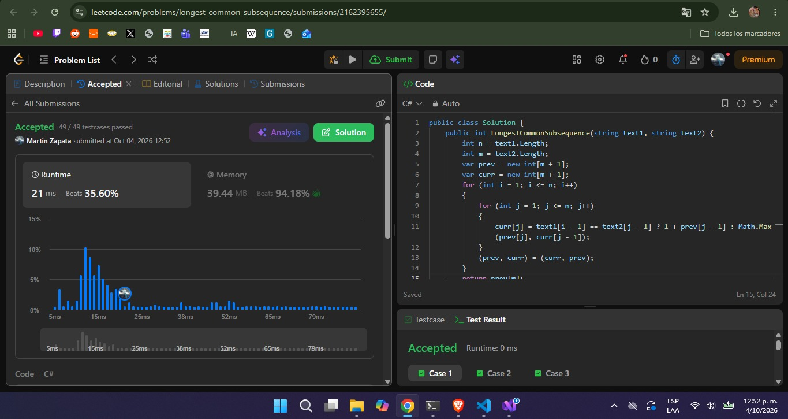
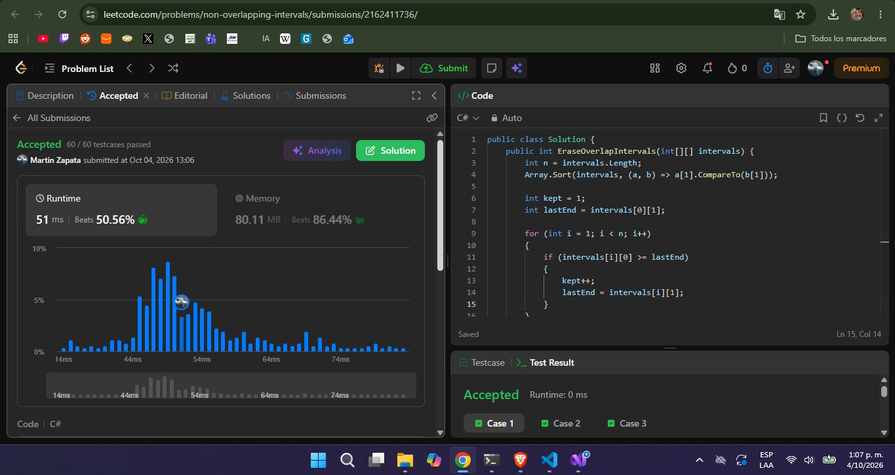
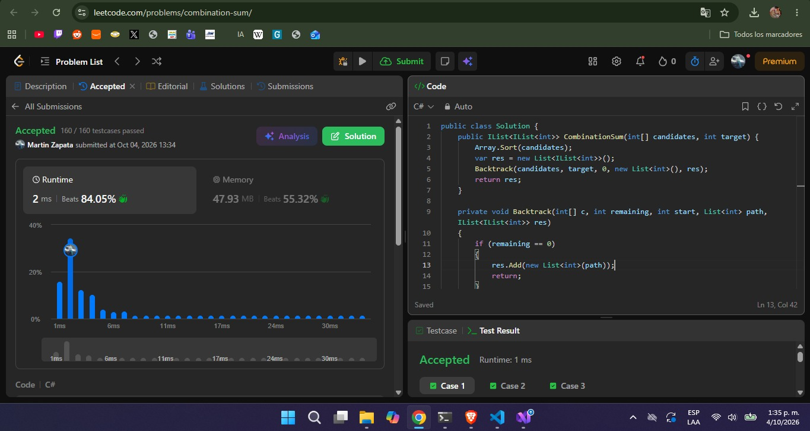

# Taller

**Curso:** Análisis de algoritmos · ITM · 2026-2

---

## 1. [56. Merge Intervals](https://leetcode.com/problems/merge-intervals/)

**Código:** [`merge-intervals/MergeIntervals.cs`](merge-intervals/MergeIntervals.cs)

**Familia:** ordenamiento

**Idea:** la clave es el extremo izquierdo (`start`). Se ordenan los intervalos con un *merge sort* propio (el `merge` de dos corridas ordenadas, aplicado recursivamente), de modo que los intervalos que se solapan quedan contiguos. Luego una sola pasada mantiene el intervalo «abierto»: si el siguiente empieza antes o justo cuando termina el actual (`start <= end`), se ensancha con `end = max(end, e)`; si no, se cierra el actual y se abre otro.

**Complejidad** (`n` = número de intervalos):
- Tiempo: `O(n log n)`, el merge sort domina y la pasada de fusión es `O(n)`.
- Espacio: `O(n)`, por el arreglo auxiliar del merge sort y la lista de salida.

---

## 2. [200. Number of Islands](https://leetcode.com/problems/number-of-islands/)

**Código:** [`number-of-islands/NumberOfIslands.cs`](number-of-islands/NumberOfIslands.cs)

**Familia:** grafos

**Modelo:** grafo implícito no dirigido. Cada celda `'1'` es un vértice; hay una arista entre dos celdas `'1'` vecinas en las cuatro direcciones ortogonales (no hay diagonales). Una isla es una componente conexa, así que el problema se reduce a contar componentes.

**Idea:** se recorre la grilla; cada vez que aparece un `'1'` no visitado se suma 1 a la respuesta y se lanza un BFS que hunde (marca como `'0'`) toda la isla. Se marca al encolar para que ninguna celda entre dos veces a la cola. Se usa BFS con cola en lugar de DFS recursivo para evitar desbordar la pila en islas grandes.

**Complejidad** (`m` filas, `n` columnas):
- Tiempo: `Θ(m·n)`, cada celda se visita una vez.
- Espacio: `O(m·n)` en el peor caso (la cola del BFS).

---

## 3. [1143. Longest Common Subsequence](https://leetcode.com/problems/longest-common-subsequence/)

**Código:** [`longest-common-subsequence/Solution.cs`](longest-common-subsequence/LongestCommonSubsequence.cs)

**Familia:** programación dinámica (tabla de prefijos), con compresión a dos filas.

**Estado:** `dp[i][j]` = longitud del LCS de `text1[0..i)` y `text2[0..j)`.

**Base:** `dp[0][j] = dp[i][0] = 0` (un prefijo vacío no comparte nada).

**Recurrencia:**
- si `text1[i-1] == text2[j-1]`: `dp[i][j] = 1 + dp[i-1][j-1]`;
- si no: `dp[i][j] = max(dp[i-1][j], dp[i][j-1])`.

**Idea:** un greedy de «tomar la primera coincidencia» falla (en `"ebcd"` y `"bcde"` da 1 en vez de 3), por eso se tabulan todos los prefijos. Como la fila `i` solo depende de la fila `i-1`, se conservan únicamente dos filas (`prev` y `curr`) y se intercambian al terminar cada fila. La respuesta es `prev[m]` al final.

**Complejidad** (`n = text1.length`, `m = text2.length`):
- Tiempo: `Θ(n·m)`.
- Espacio: `Θ(m)` con las dos filas de la implementación. Si se toma como columnas la cadena más corta, queda `Θ(min(n, m))`. La tabla completa serían `Θ(n·m)`.

---

## 4. [435. Non-overlapping Intervals](https://leetcode.com/problems/non-overlapping-intervals/)

**Código:** [`non-overlapping-intervals/NonOverlappingIntervals.cs`](non-overlapping-intervals/NonOverlappingIntervals.cs)

**Familia:** greedy (selección de actividades)

**Criterio greedy:** ordenar por `end` ascendente y, en cada paso, quedarse con el siguiente intervalo cuyo `start >= lastEnd`, es decir, el que termina antes entre los que aún caben. Lo que no se elige es lo que se borra, así que la respuesta es `n − conservados`.

**Idea:** minimizar los borrados equivale a maximizar los conservados sin solape. Terminar antes deja el mayor espacio libre a la derecha (por intercambio, reemplazar el primer intervalo de una solución óptima por el que termina antes no crea solapes ni reduce la cantidad). Ordenar por `start` falla: en `[1,100], [2,3], [4,5]` conservaría solo uno. Dos intervalos que se tocan (`start == lastEnd`) no se solapan.

**Complejidad** (`n` = número de intervalos):
- Tiempo: `O(n log n)`, el sort domina y la pasada es `O(n)`.
- Espacio: `O(1)` extra con sort in-place (más lo que use el sort).

---

## 5. [39. Combination Sum](https://leetcode.com/problems/combination-sum/)

**Código:** [`combination-sum/CombinationSum.cs`](combination-sum/CombinationSum.cs)

**Familia:** backtracking

**Qué se elige:** un candidato `candidates[i]` con `i >= start`, que se añade a la combinación actual. Puede reutilizarse (la llamada recursiva sigue en `i`), y como nunca se vuelve a índices menores no se generan permutaciones repetidas (`[2,2,3]` aparece una sola vez).

**Qué se deshace:** al regresar de la llamada se quita el último candidato añadido (`RemoveAt`) para probar el siguiente.

**Casos de parada y poda:**
- `remaining == 0`: se guarda una copia de la combinación en la respuesta.
- Si `candidates[i] > remaining` se corta la rama; con el arreglo ordenado basta un `break`, porque los siguientes son aún mayores.

**Complejidad** (`n = candidates.length`, `t = target`, `mín` = menor candidato):
- Tiempo: exponencial. La profundidad máxima es `t/mín` y el árbol tiene a lo sumo `O(n^{t/mín})` nodos (cota holgada; la poda y el índice `start` la reducen). Copiar cada solución cuesta además hasta `O(t/mín)`.
- Espacio: `O(t/mín)` para la pila de recursión y la combinación actual, más el tamaño de la salida.

---

## Resumen

| # | Problema | Familia | Tiempo | Espacio |
| --- | --- | --- | --- | --- |
| 1 | 56. Merge Intervals | Ordenamiento | `O(n log n)` | `O(n)` |
| 2 | 200. Number of Islands | Grafos | `Θ(m·n)` | `O(m·n)` |
| 3 | 1143. Longest Common Subsequence | Programación dinámica | `Θ(n·m)` | `Θ(m)` (dos filas) |
| 4 | 435. Non-overlapping Intervals | Greedy | `O(n log n)` | `O(1)` extra |
| 5 | 39. Combination Sum | Backtracking | `O(n^{t/mín})` | `O(t/mín)` + salida |