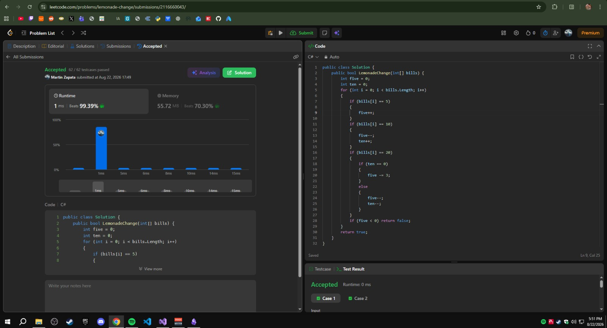
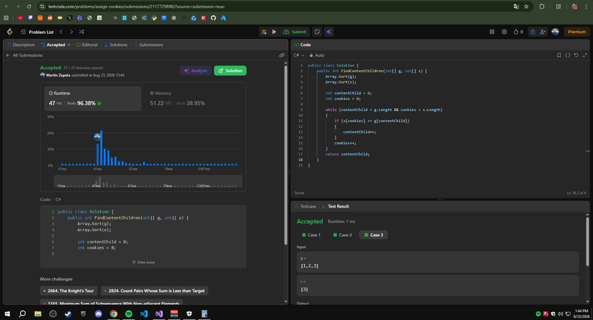

## Ejercicios Resueltos

### 1. [860. Lemonade Change](https://leetcode.com/problems/lemonade-change/)

* **Dificultad:** Easy
* **Código de la solución:** [Ver implementación en el repositorio](./lemonade-change/LemonadeChange.cs)

#### Criterio Greedy (Estrategia Local)
Al atender a un cliente, la decisión local crítica ocurre cuando nos pagan con un billete de **$20** (el cambio requerido es de **$15**). Tenemos dos opciones para dar el vuelto:
1. Dar **un billete de $10 y uno de $5**.
2. Dar **tres billetes de $5**.

Nuestra estrategia **greedy** consiste en **priorizar siempre la opción de dar un billete de $10 y uno de $5** si disponemos de ellos. 
* **Por qué:** El billete de $5 es un recurso extremadamente flexible y valioso, ya que es la única denominación que nos permite dar cambio a un cliente que paga con $10. En cambio, el billete de $10 solo sirve para dar cambio a billetes de $20. Al reservar y conservar la mayor cantidad posible de billetes de $5 (dando el de $10 primero), minimizamos el riesgo de quedarnos sin cambio en transacciones futuras.

#### Complejidad
* **Complejidad de Tiempo:** **$O(N)$**, donde $N$ es el número de clientes (longitud del arreglo `bills`). Realizamos una única pasada lineal sobre la cola de clientes para procesar cada transacción.
* **Complejidad de Espacio:** **$O(1)$** (espacio auxiliar constante). Solo necesitamos un par de variables primitivas (`five` y `ten`) para almacenar el conteo actual de billetes de $5 y $10 en caja.

#### Evidencia de Éxito (Accepted)
  

---

### 2. [455. Assign Cookies](https://leetcode.com/problems/assign-cookies/)

* **Dificultad:** Easy
* **Código de la solución:** [Ver implementación en el repositorio](./assign-cookies/AssignCookies.cs)

#### Criterio Greedy (Estrategia Local)
Para maximizar la cantidad de niños satisfechos sin desperdiciar recursos, aplicamos un enfoque voraz ordenando primero ambos arreglos (gula de niños `g` y tamaño de galletas `s`) de menor a mayor.
* **Criterio local:** Recorremos ambos arreglos utilizando dos punteros y, en cada paso, intentamos emparejar al niño con menor factor de gula activo con la **galleta más pequeña que sea capaz de satisfacerlo** (`s[j] >= g[i]`).
* **Por qué:** Si asignamos una galleta excesivamente grande a un niño con un nivel de gula bajo, estaríamos desperdiciando una galleta valiosa que podría haber satisfecho a un niño más exigente en el futuro. Si la galleta actual bajo análisis es demasiado pequeña para el niño actual, **se descarta inmediatamente** y avanzamos a la siguiente galleta; esto es correcto porque, al estar ordenado el arreglo de niños, esa galleta tampoco podrá satisfacer a ningún niño posterior (que tendrá una gula igual o mayor).

#### Complejidad
* **Complejidad de Tiempo:** **$O(N \log N + M \log M)$**, donde $N$ es la cantidad de niños (`g.Length`) y $M$ es la cantidad de galletas (`s.Length`). Este tiempo está dominado por el algoritmo de ordenamiento aplicado a ambos arreglos. El recorrido posterior con dos punteros toma un tiempo lineal de $O(N + M)$, lo cual es despreciable frente al costo de ordenar.
* **Complejidad de Espacio:** **$O(1)$** o **$O(\log N + \log M)$** de espacio auxiliar, dependiendo puramente de la implementación del algoritmo de ordenamiento utilizado por el compilador en el lenguaje elegido para ordenar los arreglos.

#### Evidencia de Éxito (Accepted)

