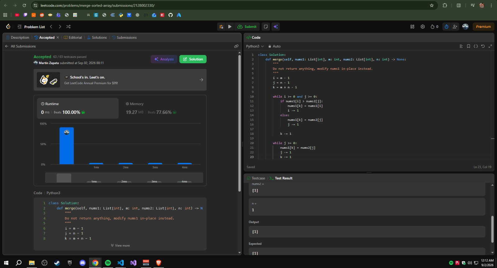
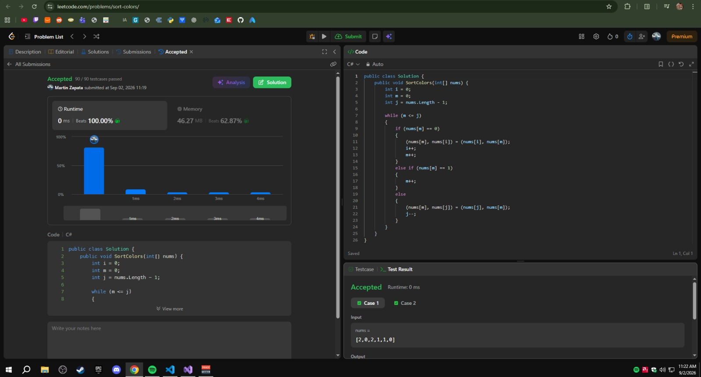

## Ejercicios Resueltos

### 1. [88. Merge Sorted Array](https://leetcode.com/problems/merge-sorted-array/)

* **Dificultad:** Easy
* **Código de la solución:** [Ver implementación en el repositorio](./merged-sorted-array/merged-sorted-array.py)

#### Algoritmo Utilizado y Justificación
Se utilizó un algoritmo de **fusión lineal desde el final (técnica de tres punteros)**. 
* **Por qué esta familia:** Dado que ambos arreglos (`nums1` y `nums2`) ya vienen ordenados de forma ascendente de origen, es altamente ineficiente concatenar los datos y aplicar un ordenamiento comparativo tradicional (como `Array.Sort()`), el cual costaría $O((m + n) \log(m + n))$.
* **Estrategia In-Place:** Al escribir los elementos de atrás hacia adelante (comenzando en el índice $m + n - 1$) y comparando los valores más grandes disponibles al final de cada subarreglo, se aprovecha el espacio de ceros preasignado al final de `nums1`. Esto evita la necesidad de utilizar un búfer o arreglo auxiliar temporal y garantiza que ningún elemento válido de `nums1` sea sobrescrito antes de ser procesado.

#### Complejidad
* **Complejidad de Tiempo:** **$O(m + n)$**, donde $m$ es el número de elementos válidos en `nums1` y $n$ es la cantidad de elementos en `nums2`. El algoritmo realiza a lo sumo una única pasada lineal comparando y ubicando cada número en su posición definitiva.
* **Complejidad de Espacio:** **$O(1)$** (espacio auxiliar constante). La fusión ocurre de manera estrictamente *in-place* dentro del propio arreglo `nums1`, utilizando únicamente tres variables de tipo entero como índices.

#### Evidencia de Éxito (Accepted)
A continuación se presenta el enlace relativo a la captura de pantalla que demuestra que la solución fue aceptada en LeetCode de manera exitosa:

---

### 2. [75. Sort Colors](https://leetcode.com/problems/sort-colors/)

* **Dificultad:** Medium
* **Código de la solución:** [Ver implementación en el repositorio](./sort-colors/SortColors.cs)

#### Algoritmo Utilizado y Justificación
Se implementó el algoritmo de la **Bandera Nacional Holandesa (partición en una sola pasada)** utilizando tres punteros de control.
* **Por qué esta familia:** El problema prohíbe explícitamente el uso de la función de ordenamiento nativa de la librería. Al ser un problema donde el universo de claves posibles es extremadamente pequeño ($k = 3$, con valores fijos de $0$, $1$ y $2$), es el escenario ideal para algoritmos lineales que no se basan en comparaciones directas de claves entre sí.
* **Evolución del Counting al One-Pass:** Mientras que un algoritmo tradicional de conteo (*Counting Sort*) resolvería este problema en dos pasadas (primero contando frecuencias y luego reescribiendo), el enfoque de la Bandera Holandesa lo resuelve en **una sola pasada** de exploración. Mantiene tres fronteras lógicas: los ceros a la izquierda (rojo), los unos en el medio (blanco) y los dos a la derecha (azul). Al clasificar cada elemento que visita el explorador y enviarlo a su respectiva frontera, se evade la cota inferior teórica de $\Omega(n \log n)$ del modelo de comparaciones pura, resolviendo el problema de forma estrictamente lineal.

#### Complejidad
* **Complejidad de Tiempo:** **$O(n)$**, donde $n$ es el número de elementos en el arreglo `nums`. La distancia entre el puntero explorador y la frontera derecha se reduce en exactamente un paso en cada iteración del ciclo, garantizando que el arreglo se procese por completo en a lo sumo $n$ pasos.
* **Complejidad de Espacio:** **$O(1)$** (espacio auxiliar constante). Todos los reordenamientos e intercambios se realizan de forma física (*in-place*) directamente sobre el arreglo original, utilizando únicamente tres variables enteras de control.

#### Evidencia de Éxito (Accepted)
A continuación se presenta el enlace relativo a la captura de pantalla que demuestra que la solución fue aceptada en LeetCode de manera exitosa:

