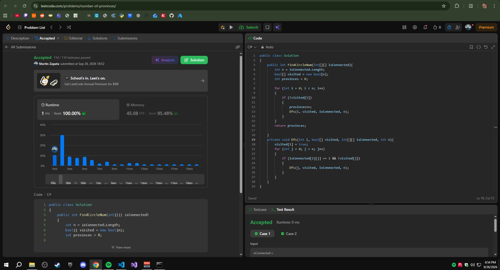
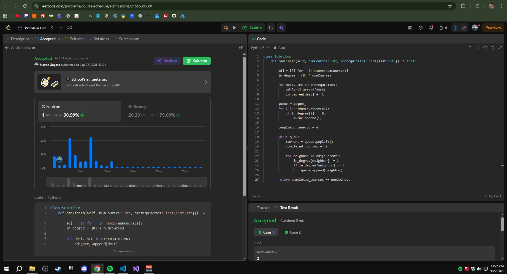

## Ejercicios Resueltos — Tarea 3: Grafos
 
### 1. [547. Number of Provinces](https://leetcode.com/problems/number-of-provinces/)
 
* **Dificultad:** Medium
* **Código de la solución:** [Ver implementación en el repositorio](./number-of-provinces/NumberOfProvinces.cs)
#### Modelo
El grafo es **no dirigido**: cada ciudad `i` (de `0` a `n-1`) es un **vértice**, y existe una **arista** entre `i` y `j` cuando `isConnected[i][j] == 1` con `i ≠ j` (la diagonal no cuenta como arista, es la ciudad conectada consigo misma por definición). Una **provincia** es exactamente una **componente conexa** de este grafo: un grupo de ciudades donde, directa o indirectamente, se puede llegar de cualquiera a cualquiera.
 
#### Algoritmo Utilizado y Justificación
Se utilizó **DFS (Depth-First Search)** para marcar componentes conexas.
* **Por qué esta familia:** el problema no pide un orden ni un camino más corto, solo agrupar vértices alcanzables entre sí. Un recorrido en profundidad es la forma más directa de "propagar" desde una ciudad no visitada hacia todas las que están conectadas con ella, sin estructuras auxiliares más allá de un arreglo de visitados.
* **Estrategia:** se recorre cada ciudad de `0` a `n-1`; cada vez que se encuentra una ciudad **no visitada**, se suma 1 al contador de provincias y se lanza un DFS que marca como visitadas todas las ciudades alcanzables desde ahí. Al terminar el recorrido externo, el contador refleja el número total de componentes conexas.
#### Complejidad
* **Complejidad de Tiempo:** **O(n²)**, donde `n` es el número de ciudades. La entrada ya es una matriz `n × n`, así que en el peor caso el DFS termina revisando cada una de las `n²` celdas de la matriz.
* **Complejidad de Espacio:** **O(n)** de espacio auxiliar, para el arreglo `visitado` más la pila de recursión del DFS (en el peor caso, una cadena de `n` ciudades conectadas entre sí).
#### Evidencia de Éxito (Accepted)
A continuación se presenta el enlace relativo a la captura de pantalla que demuestra que la solución fue aceptada en LeetCode de manera exitosa:
 

 
---
 
### 2. [207. Course Schedule](https://leetcode.com/problems/course-schedule/)
 
* **Dificultad:** Medium
* **Código de la solución:** [Ver implementación en el repositorio](./course-schedule/course-schedule.py)
#### Modelo
El grafo es **dirigido**: cada materia (de `0` a `numCourses-1`) es un **vértice**, y cada par `[a, b]` de `prerequisites` se modela como un **arco** `b → a` (hay que cursar `b` antes de `a`). En el código, cada par se lee como `[dest, src]` y se guarda `adj[src].append(dest)`, es decir, siempre con el mismo convenio: la flecha va del prerrequisito a la materia que depende de él. Es posible cursar todas las materias si y solo si este grafo es un **DAG** (no tiene ciclos); un ciclo de prerrequisitos significa un bloqueo imposible de resolver.
 
#### Algoritmo Utilizado y Justificación
Se utilizó el **algoritmo de Kahn (orden topológico por BFS, usando grados de entrada)**.
* **Por qué esta familia:** detectar si un grafo dirigido tiene un ciclo es equivalente a preguntar si existe un orden topológico completo. Kahn responde ambas preguntas a la vez: procesa primero las materias sin prerrequisitos pendientes (`in_degree == 0`) y va "liberando" las siguientes a medida que sus prerrequisitos quedan cursados.
* **Estrategia:**
  1. Se construye la lista de adyacencia `adj` y el arreglo `in_degree` recorriendo `prerequisites` una sola vez.
  2. Se encolan en una `deque` todas las materias con `in_degree == 0`. Esto incluye las materias aisladas (sin flechas), que se pueden cursar en cualquier momento y por eso también cuentan en el recuento.
  3. Mientras la cola no esté vacía, se "cursa" la materia del frente (`completed_courses += 1`) y se reduce en 1 el `in_degree` de cada materia que dependía de ella; si alguna llega a 0, se encola.
  4. Al final se devuelve `completed_courses == numCourses`. Si se cursaron menos materias que `numCourses`, quedaron materias con prerrequisitos que nunca llegaron a 0, es decir, atrapadas en un ciclo, y la respuesta es `False`.
#### Complejidad
* **Complejidad de Tiempo:** **O(n + m)**, donde `n = numCourses` y `m = prerequisites.length`. Construir la lista de adyacencia cuesta `O(m)`, y el procesamiento de la cola visita cada vértice y cada arco una sola vez.
* **Complejidad de Espacio:** **O(n + m)**, por la lista de adyacencia, el arreglo de grados de entrada (`O(n)`) y la cola (`O(n)` en el peor caso).
#### Evidencia de Éxito (Accepted)
A continuación se presenta el enlace relativo a la captura de pantalla que demuestra que la solución fue aceptada en LeetCode de manera exitosa:
 

